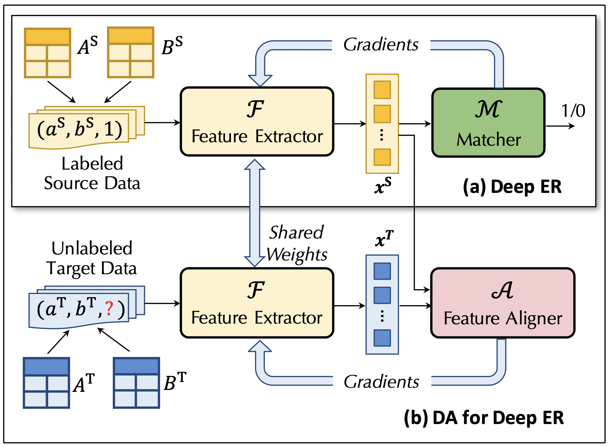
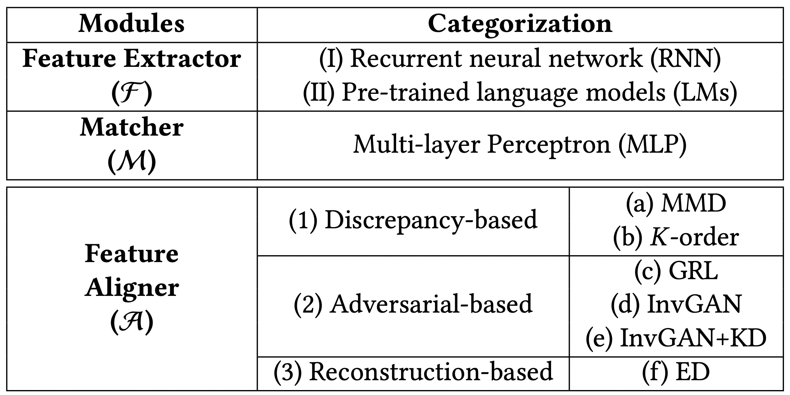

## DADER: Domain Adaptation for Deep Entity Resolution

Entity resolution (ER) is a core problem of data integration. The state-of-the-art (SOTA) results on ER are achieved by deep learning (DL) based methods, trained with a lot of labeled matching/non-matching entity pairs. This may not be a problem when using well-prepared benchmark datasets. Nevertheless, for many real-world ER applications, the situation changes dramatically, with a painful issue to collect large-scale labeled datasets. In this paper, we seek to answer: If we have a well-labeled source ER dataset, can we train a DL-based ER model for target dataset, without any labels or with a few labels? This is known as domain adaptation (DA), which has achieved great successes in computer vision and natural language processing, but is not systematically studied for ER. Our goal is to systematically explore the benefits and limitations of a wide range of DA methods for ER. To this purpose, we develop a DADER (Domain Adaptation for Deep Entity Resolution) framework that significantly advances ER in applying DA. We define a space of design solutions for the three modules of DADER, namely Feature Extractor, Matcher, and Feature Aligner. We conduct so far the most comprehensive experimental study to explore the design space and compare different choices of DA for ER. We provide guidance for selecting appropriate design solutions based on extensive experiments.

This repository contains the implementation code of six representative methods of [DADER](https://dl.acm.org/doi/10.1145/3514221.3517870): MMD, K-order, GRL, InvGAN, InvGAN+KD, ED.

## DataSets
Public datasets used in the paper are from [DeepMatcher](https://github.com/anhaidgroup/deepmatcher/blob/master/Datasets.md), [Magellan](https://sites.google.com/site/anhaidgroup/useful-stuff/the-magellan-data-repository) and [WDC](http://webdatacommons.org/largescaleproductcorpus/v2/). The details of datasets are shown in "data/dataset.md"

## Summary of Results
The main results on these benchmark datasets are summarized below:
> * Finding1: DA can significantly improve ER when the model trained on the source does not perform well on the target.
> * Finding2: Choosing a “close” source domain for DA is more beneficial.
> * Finding3: For the Feature Aligner methods, discrepancy-based methods (e.g., MMD) are more stable but adversarial-based method InvGAN+KD works the best when carefully tuning hyper-parameters.
> * Finding4: Not all successful DA methods in CV and NLP are suitable to ER.
> * Finding5: Pre-trained LM Feature Extractor works better than RNN based methods.
> * Finding6: the feature-level DA approach that learns domain-invariant and discriminative features is much better than the instance-based approach.
> * Finding7: when the labels for target datasets are available, using DA requires much less training data from the target to achieve a high accuracy, comparing with the SOTA DL based methods with/without pre-trained languages models.

## Quick Start
Step 1: Requirements
- Before running the code, please make sure your Python version is 3.6.5 and cuda version is 11.1. Then install necessary packages by :
- `pip install -r requirements.txt`
- `pip install torch==1.7.1+cu110 torchvision==0.8.2+cu110 torchaudio==0.7.2 -f https://download.pytorch.org/whl/torch_stable.html`

Step 2: Run

-    `  cd main`

Run the main function and indicate source data and target data:
-    ` python main_[mmd/k_order/grl/invgan/invgan_kd/ed/noda].py --src [source data] --tgt [target data]`

An example:
-    ` python main_invgan_kd.py --src b2 --tgt fz`

## Scripts
We provide scripts to run baseline and six methods in "scripts/":

-    `  cd scripts`
-    `  bash [mmd/k_order/grl/invgan/invgan_kd/ed/noda].sh`

## Code Structure
- Folder "modules/" contains the implementation of three component: Feature Extractor, Feature Aligner, Matcher.
- Folder "main/" contains the main function to run the six representative methods.
- Folder "train/" contains the implementation of six representative alignment.
- Folder "metrics/" contains some statistical metrics for discrepancy-based methods.
- Folder "data/" contains the datasets in our paper.
- Folder "scripts/" contains the scripts to run the experiments.